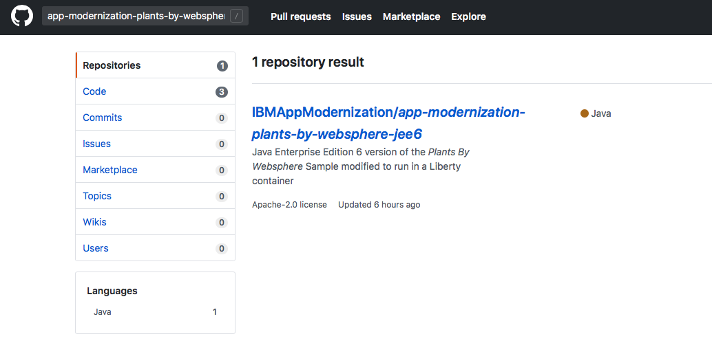

# IBM Client Developer Advocacy App Modernization Series

## Lab - Migrating Legacy JEE apps to IBM Cloud Kubernetes Service

### Part 1 - Working with Helm

## Overview

Helm is a package manager for Kubernetes. Package managers automate the process of installing, configuring, upgrading, and removing computer programs. Examples include the Red Hat Package Manager (RPM), Homebrew, and Windows® PackageManagement.

An application in Kubernetes typically consists of at least two resource types: a deployment resource, which describes a set of pods to be deployed together, and a service resource, which defines endpoints for accessing the APIs in those pods. In additional to a deployment and a service, an application will typically include other Kubernetes resource types such as ConfigMaps, Secrets, and Ingress.

For any application in Kubernetes, you will need to run several Kubernetes commands (`kubectl`) to create and configure resources. With Helm, instead of manually creating each resource separately, you can create many resources with one command (`helm install`). This greatly simplifies the process and allows you to manage the related resources as a single unit called a Helm chart.

Helm charts are stored in a Helm chart repository, which is an HTTP server that houses packaged charts and an `index.yaml` file. The `index.yaml` file has an index of all the charts in the repository. A chart repository can be any HTTP server that can serve YAML and .tar files and can answer GET HTTP requests. Therefore, you have many options for hosting your chart repository such as a Google Cloud Storage bucket, an Amazon S3 bucket or you can create your own web server. For this lab, we will be using a local test repository provided by Helm to  test the hosting of a chart repository.

In this lab you'll create a Helm chart repository and use it to deploy a small Java EE app to the IBM Cloud Kubernetes Service using the open source Helm CLI.

The instructions were adapted from https://github.com/IBMAppModernization/app-modernization-helm-lab-iks.


### Pre-requisites

1. Obtaining and installing the lab tools on non-Windows 7 platform

    If you use web terminal during the lab, you may skip this section.

    If you have done these installation steps, you may skip this section. You only do these tasks once.

    [Follow the instructions here](README_pre01.md)


### Setup

1. Lab Environment Setup

    Every time when you start a new terminal/command window, steps in the section must be performed to setup a new environment. If you lost connection in your terminal for any reason, steps in the section must alao be performed to re-establish the environment.

    [Follow the instructions here](README_pre02.md)


### Step 1: Clone the Github repo that contains the code, build an Open Liberty image of the app and then push it to the IBM Cloud Kubernetes container registry

1. Login in [your Github account](https://github.com)

2. In the search bar at the top left type in `app-modernization-plants-by-websphere-jee6`

    

3. Select the repository `IBMAppModernization\app-modernization-plants-by-websphere-jee6` and then click on the **Fork** icon

4. Click the **Clone or download** button from your copy of the forked repo and copy the HTTPS URL to your clipboard

    

5. From a client terminal window clone the Git repo  with  the following commands  appending the HTTPS URL from your clipboard

    ```text
    cd  ~
    git clone [HTTPS URL for NEW REPO]
    cd app-modernization-plants-by-websphere-jee6
    ```
6. Build the application .ear file using Maven by typing in (or copying and pasting in) the following command

    ```text
    mvn package
    ```

7. Add a new name space in registry to store your docker image

    ```
    ibmcloud  cr  namespace-add  ups_[your initial]
    export CRNAMESPACE=ups_[your initial]
    ```
    > Note: the new name space `ups_[your initial]` must be unique in the entire registry. If the new name space is not unique, change it slightly and try again.

8. Build a docker image  by typing in (or copying and pasting in) the following (uncommented) commands

    >Note: if you don't have the environment variables in the command set, replace $CRNAMESPACE with your container registry namespace and $USERNAME with your lab user id.

    ```bash
    docker build -t us.icr.io/$CRNAMESPACE/$USERNAME/pbw-mariadb-web:1.0.0 .
    ```

9. Log in to the Container registry with the following command:

    ```bash
    ibmcloud  cr login
    ```

10. Push the image to the IBM Container registry by typing in (or copying and pasting in) the following (uncommented) commands

    >Note: if you don't have the environment variables in the command set, replace $CRNAMESPACE with your container registry namespace and $USERNAME with your lab user id.

    ```bash
    docker push us.icr.io/$CRNAMESPACE/$USERNAME/pbw-mariadb-web:1.0.0
    ```

### Step 2: Look at the structure of the Helm chart for the Plants By WebSphere app

Helm chart has specific folder structure. Take a few minutes to review the example chart in the repo below.

1. Login in [your Github account](https://github.com)

2. Select your fork  of the repository **app-modernization-plants-by-websphere-jee6** that you forked in the previous lab.

3. Using the Github's UI file browser to  take a look at the files in the **chart** folder. This is a Helm chart with child charts for the web app and MariaDB  portions of the app. Since there already is a published chart for  MariaDB, it is listed  as a required child chart in the file **requirements.yaml** and you don't have to create a chart for the MariaDB portion of the app.


### Step 3: Resolve Helm Chart Dependency

The helm chart used in this lab has a dependency of chart `ibm-mariadb-dev`. Before you can deploy the chart to your cluster, the dependency must be resolved.

1. From your client terminal, execute

    ```
    helm repo add ibmcom https://raw.githubusercontent.com/IBM/charts/master/repo/stable
    ```

    This makes another repository (https://raw.githubusercontent.com/IBM/charts/master/repo/stable) accessable to you. `ibmcom` is the name of the new repository.

2. Execute command to list all available repositories for the verification purpose. `ibmcom` should be one in the list.

    ```
    helm repo list
    ```

3. Execute command to update all dependency of your chart.

    ```
    helm dependency update chart/pbw-liberty-mariadb
    ```
    Your chart has a dependency of chart `ibm-mariadb-dev`. The above command adds the tar file `ibm-mariadb-dev-1.1.2.tgz` to folder `chart/pbw-liberty-mariadb/charts`. The tar file(chart) comes from the new repository added in the previous step.


### Step 4: Configure ChartMuseum repository server

`ChartMuseum` is an open-source, easy to deploy, Helm Chart Repository server. You are going to use `ChartMuseum` to deploy a `Helm` chart later in the lab.

In order for helm to fetch and install charts from ChartMuseum, you will first need to add ChartMuseum to helm as a repository. 

1. Navigate to the home folder.

    ```
    cd ~
    ```

1. Activate `ChartMuseum` repository. In your terminal window, type the following command, to start the local test Helm repository, substitute for [PORT_NUMBER]. If you're using a web based terminal as part of an IBM instructor led workshop, use a port number derived from your username so it will be unique and not conflict with other users. The pattern is `9 + USER_NUMBER`. For example if your username is ``user023`` use port ``9023``, if your username is ``user009`` use port ``9009`` and so on. If you're using a terminal on your own machine, use any free port number.

    ```
    chartmuseum --port=[PORT_NUMBER] --storage="local" --storage-local-rootdir=".chartstorage" &
    ```

1. Make `ChartMuseum` repository accessable.

    ```
    helm repo add chartmuseum http://localhost:[PORT_NUMBER]
    ```

1. Verify that `ChartMuseum` repository is accessable now.

    ```
    helm repo list
    ```


### Step 5: Upload your chart to ChartMuseum repository

Now that ChartMuseum is up and running on your specified port, let’s upload your custom chart. 

1. Navigate to the chart folder

    ```
    cd ~/app-modernization-plants-by-websphere-jee6/chart/pbw-liberty-mariadb
    ```
1. Confirm that the chart has no compile time error.

    ```
    helm lint
    ```

1. Package the chart and generate the chart archive.

    ```
    helm package .
    Successfully packaged chart and saved it to: /root/app-modernization-plants-by-websphere-jee6/chart/pbw-liberty-mariadb/pbw-liberty-mariadb-1.0.0.tgz
    ```

    The above command creates a new package file in the current directory.The package name of the chart will be `pbw-liberty-mariadb-1.0.0.tgz`, where `pbw-liberty-mariadb` is the name of the chart and `1.0.0` is the chart version.    
    
1. Upload the package to ChartMuseum repository. Once we have the packaged chart, we can upload it to ChartMuseum by sending a post request via curl to CChartMuseumM.

    ```
    curl --data-binary "@pbw-liberty-mariadb-1.0.0.tgz" http://localhost:[PORT_NUMBER]/api/charts
    {"saved":true}
    ```

1. Regenerate `index.yaml` file for ChartMuseum repository.

    ```
    helm repo index ~/.chartstorage
    ```

1. Refresh all repository.

    ```
    helm repo update
    ```


### Step 6: Deploy the legacy JEE app from your new Helm repo

Now you are ready to deploy your chart via Helm.

1. In your terminal window type the following command, substituting your terminal user for [YOUR_USERNAME].  **Note**: Helm charts can be deployed multiple times but each deployment must have a unique name

    >Note: if you don't have the environment variables in the command set, replace $CRNAMESPACE with your container registry namespace and $USERNAME with your lab user id.

    ```
    helm install pbw-liberty-mariadb \
        --set liberty.image.registry=us.icr.io \
        --set liberty.image.namespace=$CRNAMESPACE/$USERNAME \
        chartmuseum/pbw-liberty-mariadb
    ```

### Step 7: Launch your deployed app

You'll run commands below to get the endpoint and port number of your deployed Helm release.

1. Run the following command to get the port number of your deployed app
    ```
    echo `kubectl --namespace default get service pbw-liberty-mariadb-liberty -o jsonpath='{.spec.ports[0].nodePort}'`
    ```

2. Run the following command to get the external IP address  of the first worker node in your cluster

    >Note: if you don't have the environment variables in the command set, replace $USERNAME with your lab user id.

    ```bash
    ibmcloud ks workers $USERNAME-cluster | grep -v '^*' | egrep -v "(ID|OK)" | awk '{print $2;}' | head -n1
    ```
3. In your browser's address bar enter the URL of your deployed app. The URL will be the external IP address of the first worker in your cluster followed by a colon and then followed by the port number of your deployed app. For example if your external IP is 169.61.73.182 and the port is 30961 the URL will be ```http://169.61.73.182:30961```

4. Verify that the app's UI opens in another tab. Click on the **HELP** link.


5. Click on **Reset database** to populate the MariaDB database with data

6. Verify that browsing different sections of the online catalog shows product descriptions and images.


## Cleanup

To remove the newly created name space and the newly deployed application,

```
ibmcloud  cr  namespace-rm  $CRNAMESPACE  -f
helm del pbw-liberty-mariadb
```


## Summary

With even small simple apps requiring multiple Kubernetes objects,  Helm charts greatly simplify the process of distributing and updating your Kubernetes based apps. Helm repos allow you to distribute your Helm charts via HTTP, further simplifying the process of distributing and deploying your apps.
